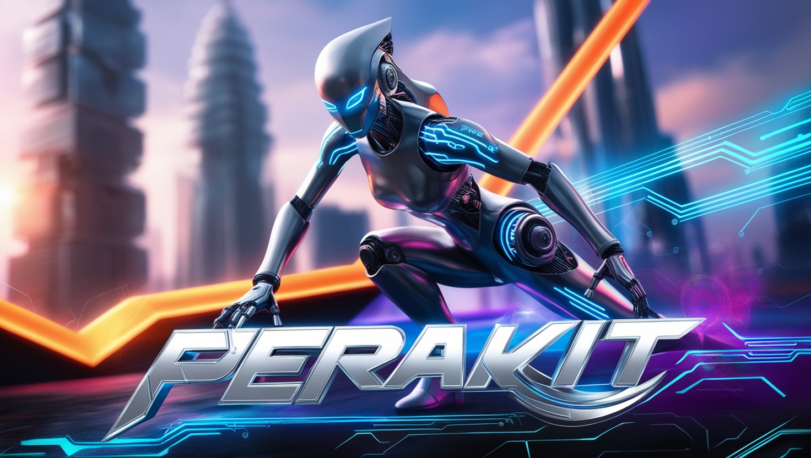
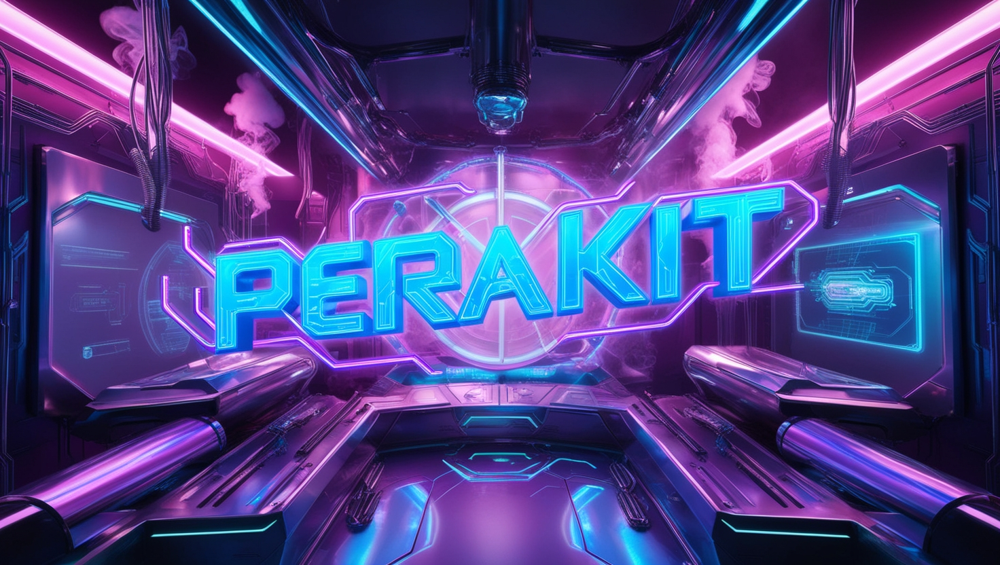

# Selamat Datang di Perakit

## Tentang Kami

Perakit adalah komunitas open-source yang berfokus pada pengembangan teknologi untuk cyberspace yang lebih baik. Kami percaya bahwa dengan bekerja sama, kita dapat menikmati kebebasan di dunia maya.

## Proyek Kami

Kami memiliki berbagai proyek yang dapat Anda kontribusikan, mulai dari pengembangan web, aplikasi, hingga alat-alat keamanan siber. Beberapa proyek utama kami meliputi:

-   **Compose-Web**: Setup podman untuk berbagai lingkungan.

## Cara Berkontribusi

Kami menyambut semua kontribusi, baik itu dalam bentuk kode, dokumentasi, atau ide. Untuk mulai berkontribusi:

1. Fork repositori ini.
2. Buat branch baru (`git checkout -b fitur-anda`).
3. Commit perubahan Anda (`git commit -am 'Menambahkan fitur'`).
4. Push ke branch (`git push origin fitur-anda`).
5. Buat Pull Request.

## Komunitas

Bergabunglah dengan komunitas kami untuk berdiskusi, berbagi ide, dan berkolaborasi:

-   Forum Diskusi
-   Grup Telegram

## Lisensi

Proyek ini dilisensikan di bawah lisensi GPL-3.0. Lihat file LICENSE untuk informasi lebih lanjut.

## Kontak

Jika Anda memiliki pertanyaan atau butuh bantuan, jangan ragu untuk menghubungi kami di support@perakit.com.

Selamat berkontribusi dan terima kasih telah bergabung dengan Perakit!

